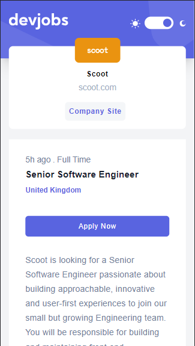
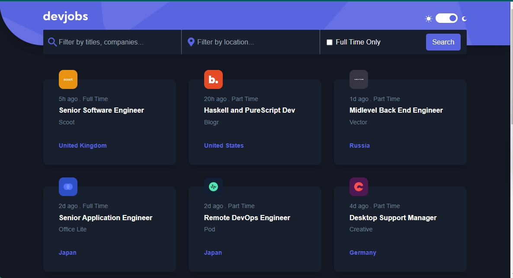
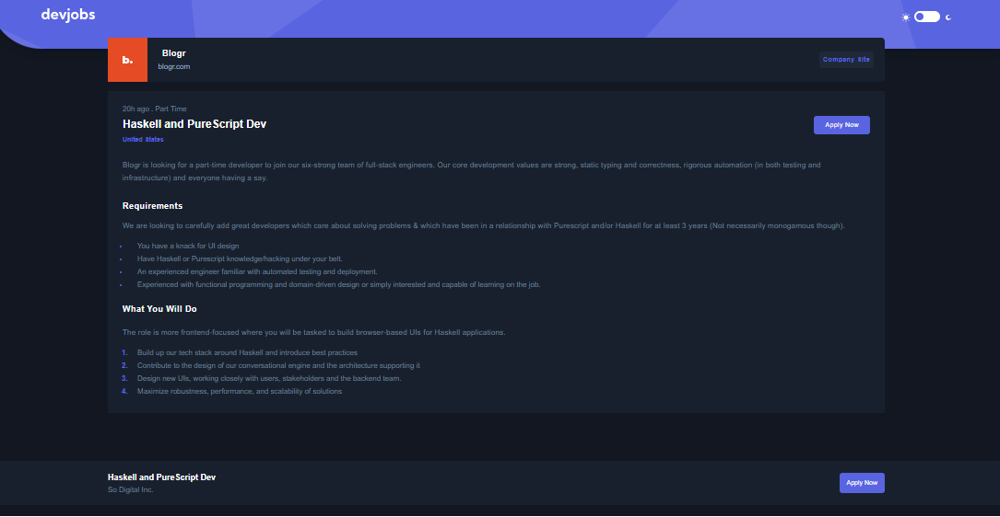
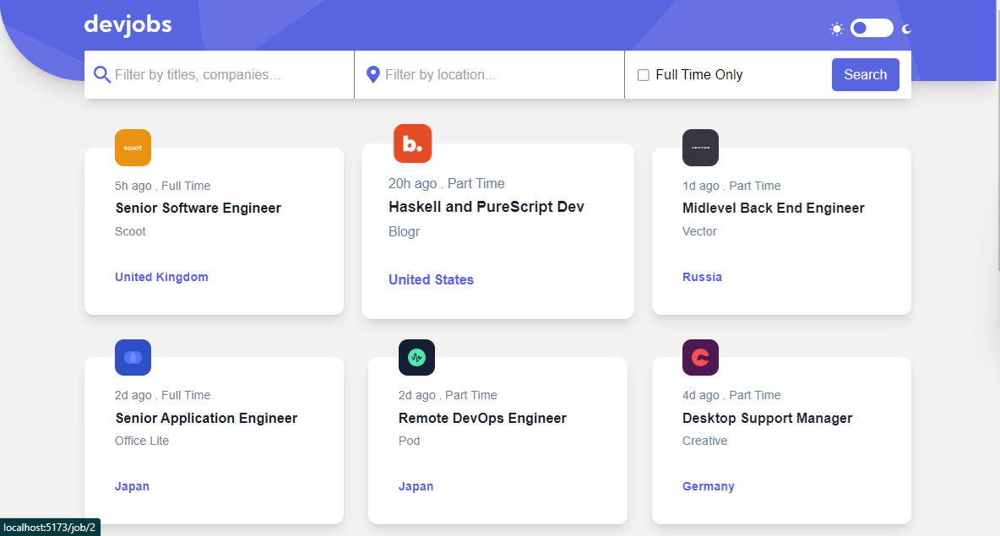
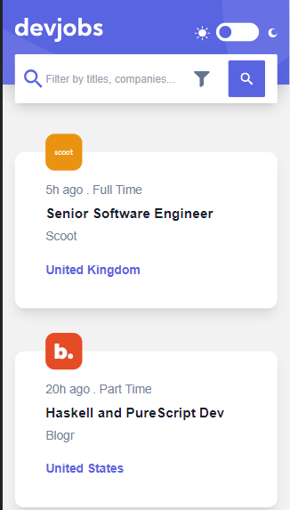

# Devjobs Web App

This is a full-stack web application for finding and applying to developer job opportunities.

## Table of Contents

- [Features](#features)
- [Screenshots](#screenshots)
- [Technologies](#technologies)
- [Installation](#installation)
- [Usage](#usage)
- [Deployment](#deployment)
- [Contact](#contact)

## Features

- View the optimal layout for each page depending on the device's screen size.
- Interactive elements throughout the site have hover states.
- Filter jobs on the index page by title, location, and whether a job is for a full-time position.
- Click on a job from the index page to read more information and apply.
- Color scheme chosen based on the user's computer preferences.
- Full-stack application built using React.js, Node.js, Express, and MongoDB.

## Screenshots

Include screenshots or GIFs showcasing the different pages and features of your application.

## Technologies

- React.js: Front-end framework for building user interfaces.
- Node.js: JavaScript runtime environment for server-side development.
- Express: Web application framework for Node.js.
- MongoDB: NoSQL database for storing job data.
- HTML5: Markup language for structuring web pages.
- Tailwind CSS: Utility-first CSS framework for styling the application.
- Framer Motion: Animation library for creating interactive and engaging UI transitions.

## Installation

To run this project locally, follow these steps:

1. Clone the repository:
   `https://github.com/akanlegumjohn/dev-jobs-web-app.git`

2. Navigate to project directory
   `cd dev-jobs-web-app`

3. Install dependencies
   `npm install`

4. Start a development server
   `npm run dev`

## Deployment

The deployed version of the application can be found at [devjobs-web-app](https://devjobsonline.netlify.app/)

## Contact

For any inquiries or feedback, please contact - GitHub: [@akanlegumjohn](https://github.com/akanlegumjohn)
